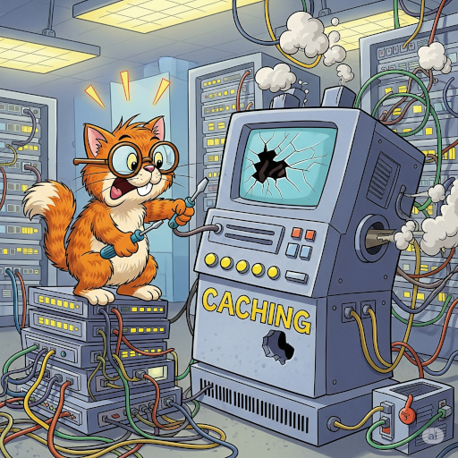

# Rediswa

<p align="center">

</p>

It is demo redis server from scratch. It donesn't contain all features.

> [!warning]
> Must not be used for production.

## How to build?

It is simple just run following command to build and run server

```fish
./run.fish
```

Why I did use fish? I just use it.

In case you use bash or other shell it is a cmake project with presets.

```bash
cmake -S . -B build/ --preset=default && \
  cmake --build build/ && \
  ./build/rediswa
```

Hope this works!

## What it is not HTTP? How to use?

Yes! it is MyProtocol. Hah! good name?

You can find a compiled client in `./build/client`. Simple to use.

```bash
./build/client <server_ip> <port> <method> <route> <body>
```

Example:

```bash
./build/client 127.0.0.1 8000 POST "/kvstore" "Key:hello Value:10"
```

## Fine! Tell me how to use redis

Here are examples

**Add**

```bash
./build/client 127.0.0.1 8000 POST "/kvstore" "Key:hello Value:10"
```

**Get**

```bash
./build/client 127.0.0.1 8000 GET "/kvstore" "Key:hello"
```

**Update**

```bash
./build/client 127.0.0.1 8000 PUT "/kvstore" "Key:hello Value:20"
```

**Delete**

```bash
./build/client 127.0.0.1 8000 DELETE "/kvstore" "Key:hello"
```
